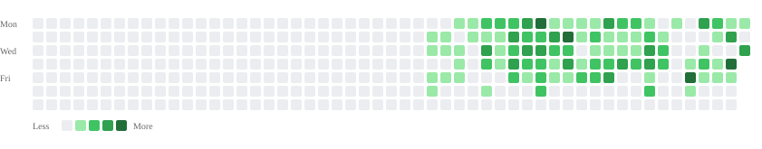

# GitLab Contribution Heatmap

Auto-synced from [jianjiale](http://192.168.10.174:9181/jianjiale) on weekdays at 18:00 (local).

| | |
|---|---|
| Synced at | `2026-11-10T18:00:07+08:00` |
| Range | `2025-11-11` → `2026-11-10` |
| Contributions | **970** |
| Active days | **101** |
| Peak day | `2026-11-10` (**46**) |

Source: GitLab Events API → daily aggregation (same idea as profile `calendar.json`).
